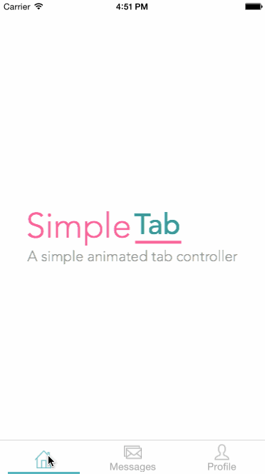

[](https://travis-ci.org/azfx/SimpleTab)
[](http://cocoapods.org/pods/SimpleTab)
[](http://cocoapods.org/pods/SimpleTab)
[](http://cocoapods.org/pods/SimpleTab)

## About
.                          |.
:-------------------------:|:-------------------------:
 | 

SimpleTab provides an easy alternative to the default UITabBarController with following support :

* Custom UI for Tab Bar Item
* Custom Tab Bar Item Animations on Tab Switching
* Custom View Transitions on Tab Switching

SimpleTab is developed with following principles :

* Simple - Easy to use and revert
* Keep the wheel - Utilize core features of UITabBarController
* Flexible - Provide hooks to customize UI and Animations


## Demo

The included example project demonstrates the usage of SimpleTab

To run the example project, clone the repo, and run `pod install` from the Example directory first.

## Requirements

* iOS 8.0+
* ARC

## Installation

SimpleTab is available through [CocoaPods](http://cocoapods.org). To install
it, simply add the following line to your Podfile:

```ruby
pod "SimpleTab"
```

> Note: SimpleTab now supports Swift 3.X starting 0.2.0 version.

## Getting Started

1.0 Import SimpleTab Framework to your Project

```swift
#import SimpleTab
```

2.0 If using Interface Builder, ensure :

* Tab Bar Controller is set as `SimpleTabBarController`
* Tab Bar is set as `SimpleTabBar`
* Tab Bar Item is set as `SimpleTabBarITem`

3.0 Get Handle to Tab Bar Controller, preferably in AppDelegate

```swift
simpleTBC = self.window!.rootViewController as? SimpleTabBarController
```

4.0 Set View Transition  
>Included Animations  
>
*  PopViewTransition  
*  CrossFadeTransition  

```swift
simpleTBC?.viewTransition = PopViewTransition()
```

5.0 Set Tab Bar Style

>Included Styles
>
* PopTabBarStyle
* ElegantTabBarStyle


```swift
var style:SimpleTabBarStyle = PopTabBarStyle(tabBar: simpleTBC!.tabBar)
```

5.1 Optional - Set Tab Title attributes for selected and unselected (normal) states.  
Or use Tint Color in the Interface Builder to set the states

```swift
style.setTitleTextAttributes([NSFontAttributeName : UIFont.systemFontOfSize(14),  NSForegroundColorAttributeName: UIColor.lightGrayColor()], forState: .Normal)
style.setTitleTextAttributes([NSFontAttributeName : UIFont.systemFontOfSize(14),NSForegroundColorAttributeName: colorWithHexString("4CB6BE")], forState: .Selected)
```

5.2 Optional - Set Tab Icon colors for selected and unselected (normal) states.  
Or use the App tint color to set the states

```swift
style.setIconColor(UIColor.lightGrayColor(), forState: UIControlState.Normal)
style.setIconColor(UIColor.blueColor(), forState: UIControlState.Selected)
```

6.0 And finally, let Tab Bar Controller know of the style in use

```swift
simpleTBC?.tabBarStyle = style
```

## Customizations
Refer [customizations](./customizations.md)

## Author

azfx, abdul.zalil@gmail.com

## License

SimpleTab is available under the MIT license. See the LICENSE file for more info.
